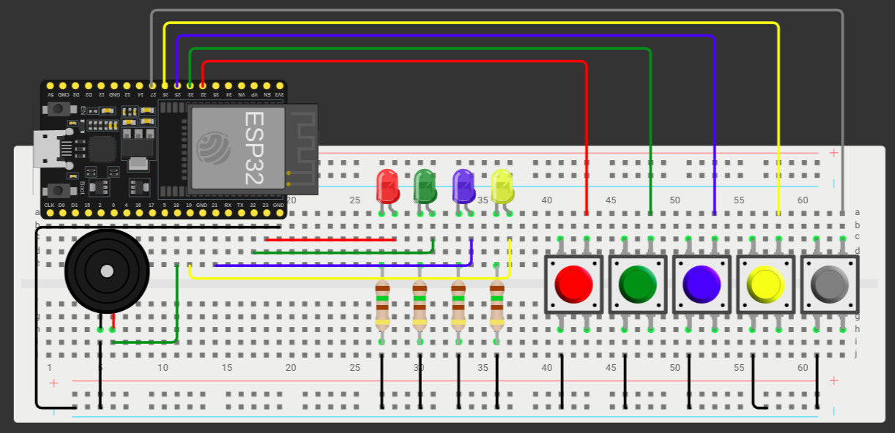

# Simon-Game
Simon Game (Genius) com ESP32

# Circuito
O circuito está montado no simulador [Wokwi](https://wokwi.com/projects/380132045729310721), e o `diagram.json` pode ser encontrado em `./Firmware/diagram.json`

# Demonstração
O vídeo demonstra o funcionamento padrão e duas condições de derrota, por erro e por timeout (muito tempo sem responder)
https://youtube.com/shorts/R8X5EZ1tziQ